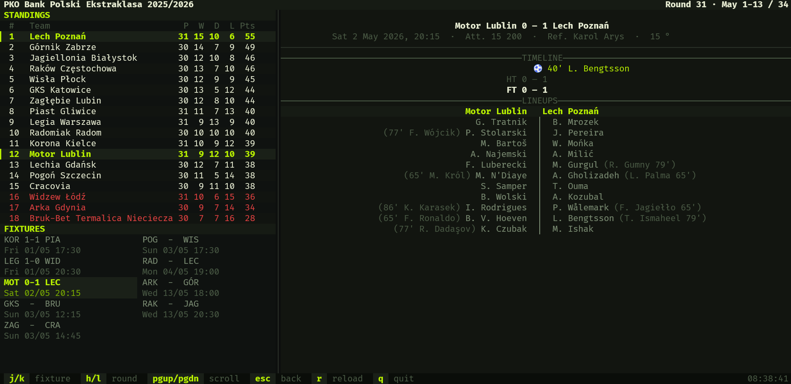

# 90minuTUI



Small Go TUI for browsing `90minut.pl`.

It is read-only. It fetches public HTML, decodes it, parses it into typed models,
and renders a terminal view for seasons, competitions, fixtures, tables, and match
details.

## Run

```bash
go run ./cmd/90minutui
```

## Controls

- `j/k` move selection; in season selector, updates competitions for that season
- `h/l` previous/next round; in selector, switch season/competition pane
- `enter` open selected season, competition, league, or match
- `esc` close match view, back out of submenus, or toggle the selector
- `tab` open selector, or switch selector focus when already open
- `pgup`/`pgdn`, `ctrl+u`/`ctrl+d` scroll match details
- `r` fresh reload current page or match from the network
- `q` quit

## What Works

- Season and competition selection from `archsezon.php`
- League tables and round fixtures
- Competition submenus for III liga, regional leagues/cups, women, and futsal
- Linkless fixtures that have scores but no match page
- Match score, timeline, metadata, lineups, substitutions, and cards

## Planned

- CLI/query API for scripts and non-interactive use

## Boundaries

- `cmd/90minutui`: program entrypoint
- `internal/site`: fetch, charset decode, parse, classify, normalize
- `internal/ui`: Bubble Tea state and presentation from `site` models

Pipeline: `fetch/decode -> parse/classify -> render/present`.

Keep source-shape logic in `internal/site`. UI code may derive display state from
typed models, but should not parse raw HTML.

## Parser Notes

- 90minut may use `iso-8859-2`; decode before parsing.
- Prefer semantic selectors and stable URLs/IDs over table offsets.
- Parser tests use saved HTML fixtures under `internal/site/testdata`.
- Add or refresh fixtures when upstream HTML changes.

```bash
go run ./cmd/fetchfixtures
go test ./...
```

## Checks

```bash
go test ./...
go vet ./...
```

Optional local hooks:

```bash
prek install
prek run -a
```
