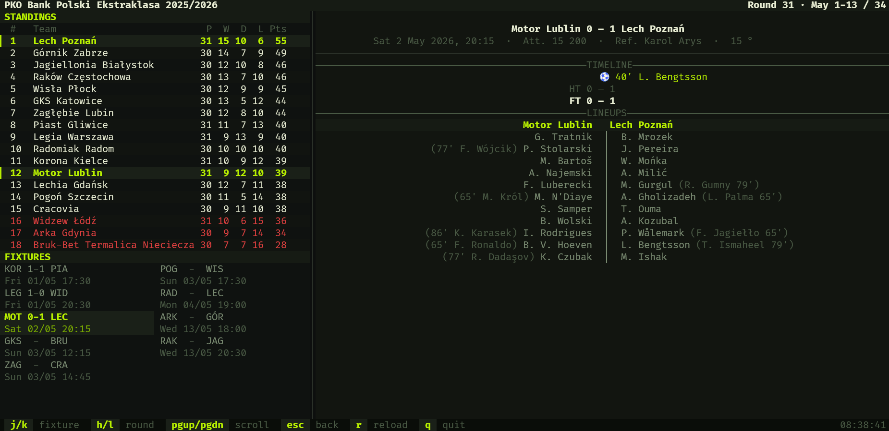

# 90minuTUI

Browse `90minut.pl` from your terminal. A read-only Go TUI for Polish football: seasons, competitions, fixtures, tables, and full match details, rendered from the site's public HTML.



## Run

```bash
go run ./cmd/90minutui
```

## Keys

| Key | Action |
| --- | --- |
| `j`/`k` | Move selection; in the season selector, updates competitions for that season |
| `h`/`l` | Previous/next round; in the selector, switch season/competition pane |
| `enter` | Open selected season, competition, league, or match |
| `esc` | Close match view, back out of submenus, or toggle the selector |
| `tab` | Open the selector, or switch its focus when already open |
| `pgup`/`pgdn`, `ctrl+u`/`ctrl+d` | Scroll match details |
| `r` | Fresh reload of the current page or match from the network |
| `q` | Quit |

## What you can browse

Season and competition selection, league tables and round fixtures, competition submenus for III liga, regional leagues and cups, women's and futsal football — including linkless fixtures that have scores but no match page. Match view shows score, timeline, metadata, lineups, substitutions, and cards.

For scripts and non-interactive use, there is a JSON CLI/query API: see [CLI Data Export](docs/cli.md).

## How it works

`internal/site` fetches public HTML, decodes it (the site may use `iso-8859-2`), parses it into typed models, and classifies pages. `internal/ui` is Bubble Tea state and presentation built on those models — UI code derives display state but never parses raw HTML. Parser tests use saved HTML fixtures under `internal/site/testdata`; refresh them with `go run ./cmd/fetchfixtures` when upstream HTML changes.

## Development

```bash
go test ./...
go vet ./...
```

Optional local hooks:

```bash
prek install
prek run -a
```